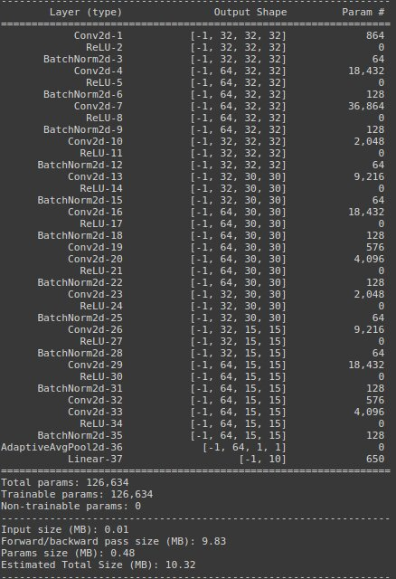

# CIFAR10-S7

Target - 
1. Design network for CIFAR10 dataset, using at least 1 depthwise separable, dilated convolution & without using Maxpool.
2. Augmentations (using Albumentations lib)
    a. Horizontal Flip 
    b. shiftScaleRotate
    c. coarseDropout
4. Achieve 85% validation accuracy using <200k parameters

Model summary
1.  126k parameters, with 2 depthwise separable convolutions, 1 dilated convolution.
2.  RF of 40

Results
1. Validation accuracy
    a.  85.32% in 32 epochs
    b.  87.02% in 49 epochs
2.  Train, validation convergence plots

